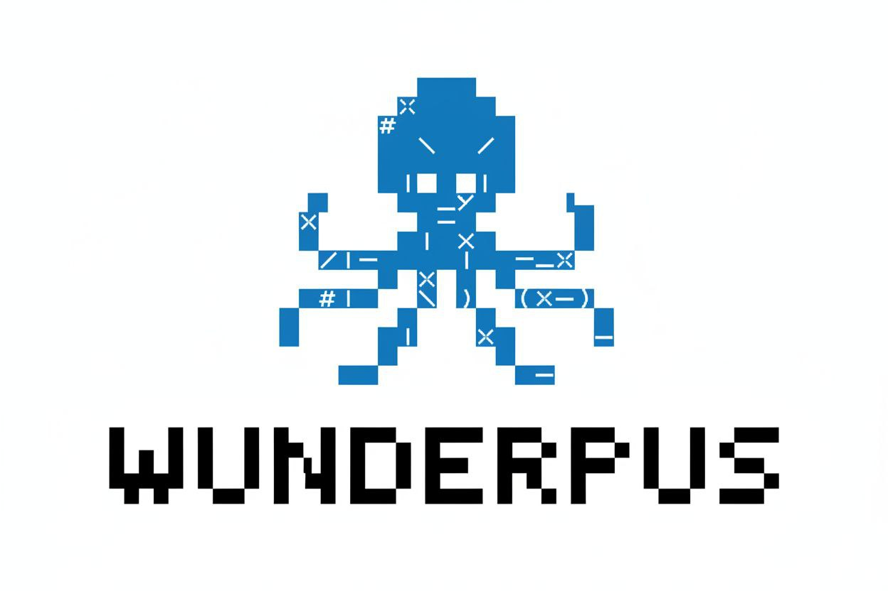

# Wunderpus

<p align="center">
  
</p>

<p align="center">
  <a href="https://github.com/wunderpus/wunderpus/actions/workflows/ci.yml">
    
  </a>
  <a href="https://golang.org/doc/devel/release.html#policy">
    
  </a>
  <a href="https://github.com/wunderpus/wunderpus/blob/main/LICENSE">
    
  </a>
  <a href="https://discord.gg/wunderpus">
    
  </a>
  <a href="https://github.com/wunderpus/wunderpus/releases">
    
  </a>
</p>

Wunderpus is a powerful, vendor-agnostic autonomous AI agent framework written in Go. It provides a unified interface to interact with multiple Large Language Model (LLM) providers through various communication channels, with built-in security features, an extensible skills system, and a comprehensive tool execution environment.

## Features

### Multi-Provider Support
Wunderpus supports 15+ LLM providers out of the box, enabling vendor-agnostic AI interactions:

- **OpenAI**: GPT-4o, GPT-4o-mini, GPT-4 Turbo
- **Anthropic**: Claude Sonnet 4, Claude Opus, Claude Haiku
- **Google Gemini**: Gemini 2.0 Flash, Gemini 1.5 Pro
- **Ollama**: Local Llama 3.2, Mistral, and other models
- **OpenRouter**: Access to 100+ models through unified API
- **Groq**: Fast inference with Llama 3.3, Mixtral
- **DeepSeek**: DeepSeek R1, DeepSeek Chat
- **Cerebras**: Ultra-fast inference at scale
- **NVIDIA NIM**: Enterprise-grade inference
- And more: Zhipu (GLM), Moonshot (Kimi), Mistral, vLLM, LiteLLM, Qwen, Volcanic Engine

### Multi-Channel Interface
Connect to Wunderpus through multiple communication platforms:

- **TUI (Terminal User Interface)**: Interactive terminal experience with command palette
- **Telegram**: Bot-based messaging integration
- **Discord**: Server-based AI assistant
- **WebSocket**: Real-time bidirectional communication
- **QQ**: Chinese messaging platform
- **WeCom**: WeChat Work integration
- **DingTalk**: Enterprise communication platform
- **OneBot**: Standardized bot protocol

### Extensible Tool System
Wunderpus provides a powerful tool execution environment:

- **Shell Command Execution**: Sandboxed command execution with allowlist
- **File Operations**: Read, write, search, and manipulate files
- **MCP Client/Server**: Model Context Protocol support for external tools
- **Web Search**: Brave, Tavily, DuckDuckGo, Perplexity integration
- **Custom Tools**: Create and register custom tool handlers
- **Sub-Agent Spawning**: Asynchronous parallel task execution

### Skills System
Extend Wunderpus capabilities with skills:

- **GitHub Integration**: Issue tracking, PR management, CI/CD monitoring
- **Tmux Management**: Terminal session automation
- **Weather Information**: Real-time weather data
- **Content Summarization**: Automatic content summarization
- **Skill Creator**: Build new skills from natural language
- **Version Control**: Semantic versioning for skill management
- **Custom Registries**: Pull skills from ClawHub or custom registries

### Security Features
Enterprise-grade security built-in:

- **Encryption at Rest**: AES-256-GCM encryption for sensitive data
- **Audit Logging**: Comprehensive SQLite-based audit trail
- **Rate Limiting**: Configurable request throttling
- **Shell Sandboxing**: Regex-based command filtering with allowlist
- **SSRF Protection**: Blocklist for dangerous network destinations
- **Workspace Isolation**: Restrict file operations to designated directories

### Additional Capabilities

- **SQLite Session Persistence**: Maintain conversation history across restarts
- **Provider Fallback**: Automatic failover with cooldown periods
- **Parallel Provider Probing**: Quick response time with concurrent provider checks
- **Async Tool Execution**: Non-blocking tool operations
- **Heartbeat Scheduling**: Cron-based periodic task execution
- **Cost Tracking**: Token usage and cost monitoring per provider
- **Prometheus Metrics**: Export health and performance metrics
- **Health Checks**: Built-in HTTP health server

## Quick Start

### Installation

#### Binary Releases

Download pre-built binaries from the [releases page](https://github.com/wunderpus/wunderpus/releases):

```bash
# Linux/macOS
curl -sL https://github.com/wunderpus/wunderpus/releases/latest/download/wunderpus-linux-amd64.tar.gz | tar xz
sudo mv wunderpus /usr/local/bin/

# macOS with Homebrew
brew install wunderpus/wunderpus/wunderpus
```

#### Docker

```bash
# Pull the image
docker pull wunderpus/wunderpus:latest

# Run with config mount
docker run -it -v $(pwd)/config.yaml:/app/config.yaml wunderpus/wunderpus:latest
```

#### From Source

```bash
# Clone the repository
git clone https://github.com/wunderpus/wunderpus.git
cd wunderpus

# Build
make build

# Or run directly
go run cmd/wunderpus/main.go
```

### Configuration

1. Copy the example configuration:

```bash
cp config.example.yaml config.yaml
```

2. Edit `config.yaml` and add your API keys. The minimal configuration requires at least one provider:

```yaml
# Minimal configuration with OpenAI
providers:
  openai:
    api_key: "sk-your-api-key-here"
    model: "gpt-4o"

# Or use the new model_list format (recommended)
model_list:
  - model_name: "gpt-primary"
    model: "openai/gpt-4o"
    api_key: "sk-your-api-key-here"
```

3. Set environment variables (optional, takes precedence over config file):

```bash
export OPENAI_API_KEY="sk-your-api-key-here"
export ANTHROPIC_API_KEY="sk-ant-your-api-key-here"
```

### Running

```bash
# Start the interactive TUI
wunderpus

# One-shot message (no TUI)
wunderpus agent -m "Hello, help me write a function to calculate fibonacci numbers"

# Start the gateway (background services + channels)
wunderpus gateway
```

## Architecture Overview

Wunderpus follows a modular architecture designed for extensibility and scalability:

```
┌─────────────────────────────────────────────────────────────────┐
│                         CLI Layer                               │
│  (Cobra Commands: agent, gateway, skills, cron, auth)          │
└─────────────────────────────────────────────────────────────────┘
                              │
┌─────────────────────────────────────────────────────────────────┐
│                      Application Layer                          │
│  (Bootstrap, Configuration, Channel Management)                │
└─────────────────────────────────────────────────────────────────┘
                              │
        ┌───────────────────┼───────────────────┐
        │                   │                   │
        ▼                   ▼                   ▼
┌───────────────┐   ┌───────────────┐   ┌───────────────┐
│    Agent      │   │   Channel     │   │   Skills      │
│   Manager     │   │   Manager     │   │   Loader      │
│               │   │               │   │               │
│ - Sessions    │   │ - Telegram    │   │ - Discovery   │
│ - Providers   │   │ - Discord     │   │ - Execution   │
│ - Memory      │   │ - WebSocket   │   │ - Versioning  │
└───────────────┘   └───────────────┘   └───────────────┘
        │                   │                   │
        ▼                   ▼                   ▼
┌───────────────┐   ┌───────────────┐   ┌───────────────┐
│   Provider    │   │   Channel     │   │    Skills    │
│   Adapters    │   │  Implement.   │   │   Registry    │
│               │   │               │   │               │
│ - OpenAI      │   │ - Protocol    │   │ - Built-in    │
│ - Anthropic   │   │   Handlers    │   │ - Global      │
│ - Ollama      │   │ - Message     │   │ - Remote      │
│ - Gemini      │   │   Queue       │   │               │
│ - [15+]       │   │               │   │               │
└───────────────┘   └───────────────┘   └───────────────┘
```

### Core Components

#### Agent Manager
The Agent Manager orchestrates conversation sessions, provider selection, and tool execution. Each session maintains its own context and can operate independently.

#### Provider System
Providers are abstracted through a common interface, enabling:
- Unified request/response handling
- Automatic fallback on provider failures
- Parallel probing for fastest response
- Cost tracking per request

#### Channel System
Channels bridge external communication platforms with the agent system. Each channel handles:
- Platform-specific authentication
- Message parsing and formatting
- Event subscription (messages, callbacks, webhooks)
- Rate limiting and quota management

#### Skills System
Skills are modular capability packages that extend agent functionality:
- **Manifest-based**: YAML-defined metadata and dependencies
- **Versioned**: Semantic versioning for compatibility
- **Composable**: Skills can depend on other skills
- **Discoverable**: Query available skills at runtime

## Supported Providers

| Provider | Protocol | Models | API Base |
|----------|----------|--------|----------|
| OpenAI | openai | gpt-4o, gpt-4o-mini, gpt-4-turbo | https://api.openai.com/v1 |
| Anthropic | anthropic | claude-sonnet-4, claude-opus-4 | https://api.anthropic.com |
| Google Gemini | gemini | gemini-2.0-flash, gemini-1.5-pro | https://generativelanguage.googleapis.com |
| Ollama | ollama | llama3.2, mistral, codellama | http://localhost:11434 |
| OpenRouter | openai | 100+ models | https://openrouter.ai/api/v1 |
| Groq | openai | llama-3.3-70b, mixtral-8x7b | https://api.groq.com/openai/v1 |
| DeepSeek | openai | deepseek-r1, deepseek-chat | https://api.deepseek.com/v1 |
| Cerebras | openai | llama-3.3-70b | https://api.cerebras.ai/v1 |
| NVIDIA NIM | openai | llama-3.1-nemotron-70b | https://integrate.api.nvidia.com/v1 |
| Zhipu (GLM) | openai | glm-4, glm-4v | https://open.bigmodel.cn/api/paas/v4 |
| Moonshot | openai | kimi-latest, kimi-k2 | https://api.moonshot.cn/v1 |
| Mistral | openai | mistral-large, codestral | https://api.mistral.ai/v1 |
| vLLM | openai | Any vLLM-served model | http://localhost:8000/v1 |
| LiteLLM | openai | Any LiteLLM-proxied model | http://localhost:4000/v1 |
| Qwen | openai | qwen-turbo, qwen-plus | https://dashscope.aliyuncs.com/api/v1 |

## Configuration Examples

### Basic: Single Provider

```yaml
default_provider: "openai"
providers:
  openai:
    api_key: "sk-your-key"
    model: "gpt-4o"
    max_tokens: 4096
```

### Advanced: Multiple Providers with Fallback

```yaml
model_list:
  - model_name: "primary"
    model: "openai/gpt-4o"
    api_key: "sk-primary-key"
    max_tokens: 4096
    fallback_models:
      - "anthropic/claude-sonnet-4-20250514"
      - "openrouter/deepseek/deepseek-r1"

  - model_name: "fast"
    model: "groq/llama-3.3-70b-versatile"
    api_key: "gsk-fast-key"
    api_base: "https://api.groq.com/openai/v1"

  - model_name: "local"
    model: "ollama/llama3.2"
    api_base: "http://localhost:11434"
```

### Channel Configuration

```yaml
# Telegram
telegram:
  enabled: true
  bot_token: "your-bot-token"

# Discord
discord:
  enabled: true
  bot_token: "your-discord-token"
  guild_id: "your-guild-id"

# WebSocket
websocket:
  enabled: true
  host: "0.0.0.0"
  port: 8081
```

### Security Configuration

```yaml
security:
  encryption:
    enabled: true
    key: "base64-encoded-32-byte-key"  # Generate: openssl rand -base64 32
  audit_db_path: "wunderpus_audit.db"

tools:
  enabled: true
  shell_whitelist:
    - git
    - go
    - npm
    - cargo
  allowed_paths:
    - "/home/user/projects"
  restrict_to_workspace: true
```

## Skills System

### Built-in Skills

Wunderpus ships with several built-in skills:

| Skill | Description | Dependencies |
|-------|-------------|--------------|
| github | GitHub CLI integration for issues, PRs, CI | gh CLI |
| tmux | Terminal multiplexer automation | tmux |
| weather | Current weather and forecasts | None |
| summarize | Content summarization | None |
| skill-creator | Generate new skills from description | None |

### Creating Custom Skills

Skills are defined by a `SKILL.md` file in a dedicated directory:

```
skills/my-skill/
  SKILL.md        # Skill manifest and documentation
  handler.go      # Optional: custom Go handler
  tools/          # Additional tools or scripts
```

Example SKILL.md:

```markdown
---
name: my-skill
description: "Description of what the skill does"
metadata:
  version: "1.0.0"
  author: "Your Name"
---

# My Skill

Description of the skill's capabilities and how to use it.

## Usage

Use the skill with specific commands or natural language.
```

### Installing External Skills

```bash
# From GitHub
wunderpus skills install https://github.com/user/skill-name

# From local path
wunderpus skills install ./path/to/skill

# List available skills
wunderpus skills list
```

## Security

### Encryption

Wunderpus supports AES-256-GCM encryption for sensitive configuration data:

```yaml
security:
  encryption:
    enabled: true
    key: "base64-encoded-32-byte-key"
```

Generate a key:
```bash
openssl rand -base64 32
```

### Audit Logging

All agent actions are logged to SQLite for compliance and debugging:

```yaml
security:
  audit_db_path: "wunderpus_audit.db"
```

### Rate Limiting

Configure per-user or global rate limits:

```yaml
security:
  rate_limit:
    requests_per_minute: 60
    burst: 10
```

### Shell Sandboxing

Commands are filtered against an allowlist:

```yaml
tools:
  shell_whitelist:
    - git
    - go
    - npm
    - cargo
    - docker
```

## Contributing

Contributions are welcome! Please read our [Contributing Guide](CONTRIBUTING.md) for details on:

- Code style and conventions
- Development setup
- Testing requirements
- Pull request process

## License

Wunderpus is distributed under the MIT License. See [LICENSE](LICENSE) for details.

## Community

- **Discord**: Join our [Discord server](https://discord.gg/wunderpus) for discussion and support
- **GitHub Discussions**: Ask questions and share ideas
- **Issues**: Report bugs and request features

## Resources

- [Documentation](docs/README.md)
- [Configuration Reference](docs/configuration.md)
- [Architecture Deep Dive](docs/architecture.md)
- [Installation Guide](docs/installation.md)
- [CLI Reference](docs/cli.md)
- [Skills Documentation](docs/skills.md)
- [Deployment Guide](docs/deployment.md)
