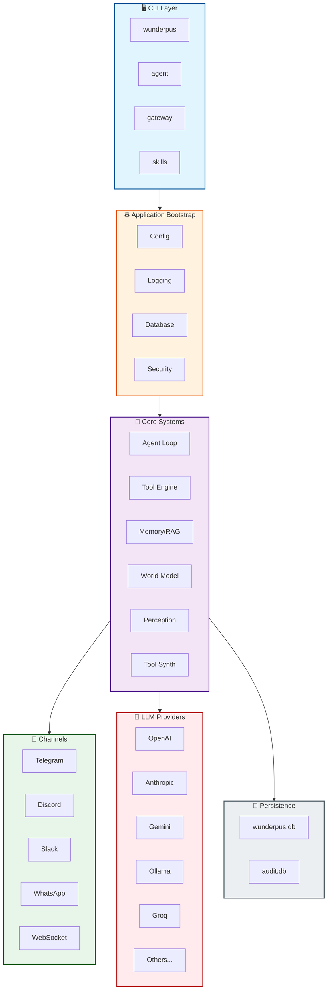
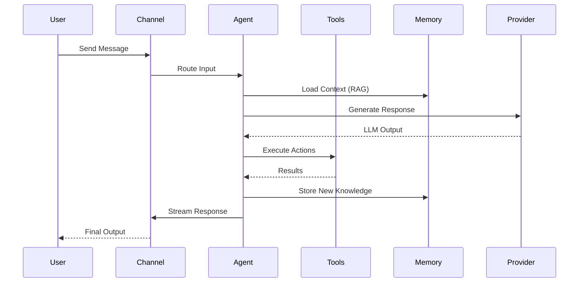
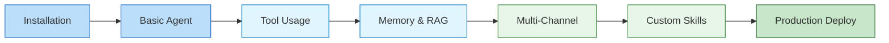

<!-- Banner Header -->
<div align="center">
  <h1>🐙 Wunderpus</h1>
  <h3>Universal Autonomous AI Agent Framework</h3>
  <p><em>Production-grade, vendor-agnostic, and written in Go</em></p>
</div>

<br/>

<!-- Badges -->
<div align="center">

[](https://golang.org/doc/devel/release.html#policy)
[](LICENSE)
[](https://github.com/wunderpus/wunderpus/actions)
[](https://goreportcard.com/report/wunderpus/wunderpus)

[](https://github.com/wunderpus/wunderpus/stargazers)
[](https://github.com/wunderpus/wunderpus/network/members)
[](https://github.com/wunderpus/wunderpus/issues)
[](https://github.com/wunderpus/wunderpus/graphs/contributors)

</div>

<br/>

<!-- Hero Image / Diagram -->
<div align="center">
  
</div>

---

## 📖 Table of Contents

<details open>
<summary><b>Click to expand navigation</b></summary>

- [✨ Features](#-features)
- [🏗️ Architecture](#️-architecture)
- [⚡ Quick Start](#-quick-start)
- [🔌 Supported Providers](#-supported-providers)
- [🛡️ Security Model](#️-security-model)
- [📁 Project Structure](#-project-structure)
- [📚 Documentation](#-documentation)
- [🤝 Contributing](#-contributing)
- [📄 License](#-license)

</details>

---

## ✨ Features

<div align="center">

| 🧠 **Intelligence** | 🔗 **Integration** | ⚙️ **Operations** |
|:---:|:---:|:---:|
| Multi-Provider LLM Routing | Multi-Channel Messaging | Tool Synthesis Engine |
| RAG-Powered Memory | 5+ Platform Connectors | World Model Knowledge Graph |
| Conversation Branching | Real-time WebSocket | Computer Vision (Playwright) |
| Self-Improvement Loop | Unified Multi-Modal Input | Cost Prediction & Budgeting |
| Structured JSON Output | Event-Driven Webhooks | Checkpoint & Resume |
| Autonomous Goal Setting | Health Monitoring | OpenTelemetry Tracing |

</div>

### 🎯 Core Capabilities Deep Dive

<details>
<summary><b>🤖 Multi-Provider LLM Intelligence</b></summary>

Connect to **15+ LLM providers** with intelligent fallback and load balancing:

- ✅ **Enterprise**: OpenAI GPT-4o, Anthropic Claude, Google Gemini
- ✅ **High-Speed**: Groq, Cerebras, NVIDIA NIM
- ✅ **Open Source**: Ollama, vLLM, DeepSeek, Qwen, Mistral
- ✅ **Aggregators**: OpenRouter (100+ models), LiteLLM proxy

</details>

<details>
<summary><b>💬 Multi-Channel Communication</b></summary>

Deploy agents across all major platforms **simultaneously**:

<div align="center">

| Platform | Status | Features |
|:--------:|:------:|:---------|
|  | ✅ Ready | Groups, Bots, Inline |
|  | ✅ Ready | Servers, DMs, Threads |
|  | ✅ Ready | Channels, Workspaces |
|  | ✅ Ready | Business API |
|  | ✅ Ready | Real-time Streaming |

</div>

</details>

<details>
<summary><b>🔧 Advanced Tool System</b></summary>

**15+ built-in tools** with enterprise-grade security:

```yaml
tools:
  - filesystem: read, write, search (sandboxed)
  - shell: command execution (policy-gated)
  - http: REST API calls with auth
  - browser: Playwright automation
  - calculator: math expressions
  - code: multi-language execution
  - database: SQL operations
  - email: SMTP/IMAP integration
  - calendar: scheduling & reminders
  - search: web & local indexing
  - vision: image analysis
  - audio: transcription & synthesis
  - document: PDF/DOCX parsing
  - crypto: encryption/decryption
  - network: port scanning & discovery
```

</details>

<details>
<summary><b>🧠 Memory & RAG System</b></summary>

- **Persistent Sessions**: SQLite-backed with AES-256-GCM encryption
- **Vector Search**: Semantic similarity matching
- **SOP Retrieval**: Standard Operating Procedures auto-loading
- **Context Windows**: Intelligent summarization & compression
- **Long-Term Memory**: Cross-session knowledge retention

</details>

<details>
<summary><b>🕸️ World Model Knowledge Graph</b></summary>

Build and query a **persistent knowledge graph**:

- Entity & Relation Tracking
- Confidence Scoring
- Cypher-like Query Language
- Automatic Inference
- Temporal Reasoning

</details>

---

## 🏗️ Architecture

<div align="center">
  
</div>



### 🔄 Data Flow



---

## ⚡ Quick Start

<div align="center">

[](#quick-start)
[](https://hub.docker.com/r/wunderpus/wunderpus)
[](docs/guides/getting-started.md)

</div>

### 📋 Prerequisites

<div align="center">

| Requirement | Version | Install |
|:-----------:|:-------:|:-------:|
|  | 1.25+ | [golang.org](https://golang.org/dl/) |
|  | Latest | [docker.com](https://www.docker.com/get-started) |
|  | 18+ | [nodejs.org](https://nodejs.org/) |

</div>

### 🚀 Installation

#### Option 1: Build from Source

```bash
# 📥 Clone the repository
git clone https://github.com/wunderpus/wunderpus.git
cd wunderpus

# 🔨 Build the binary
go build -o build/wunderpus ./cmd/wunderpus

# ⚙️ Configure your environment
cp config.example.yaml config.yaml
# Edit config.yaml with your API keys

# ▶️ Run interactive TUI
./build/wunderpus
```

#### Option 2: One-Shot Command

```bash
# Run a single agent command
./build/wunderpus agent -m "What can you do?"
```

#### Option 3: Gateway Mode (Background Services)

```bash
# Start all configured channels and services
./build/wunderpus gateway
```

#### Option 4: Docker Deployment

```bash
# Build the image
docker build -t wunderpus:latest .

# Run with mounted config
docker run -d \
  -p 8080:8080 \
  -p 9090:9090 \
  -v $(pwd)/config.yaml:/app/config.yaml \
  wunderpus:latest
```

#### Option 5: Docker Compose

```bash
# Start full stack (agent + monitoring + database)
docker-compose up -d
```

---

## 🔌 Supported Providers

<div align="center">
  
</div>

| Provider | Protocol | Popular Models | Free Tier | Latency |
|:--------:|:--------:|:--------------:|:---------:|:-------:|
|  | `openai` | GPT-4o, GPT-4o-mini | ❌ | ⚡⚡⚡ |
|  | `anthropic` | Claude Sonnet-4, Opus-4 | ❌ | ⚡⚡⚡ |
|  | `gemini` | Gemini 2.0 Flash, 1.5 Pro | ✅ | ⚡⚡⚡ |
|  | `ollama` | Any Local Model | ✅ | ⚡⚡⚡⚡⚡ |
|  | `openai` | Llama-3.3-70B, Mixtral | ✅ | ⚡⚡⚡⚡⚡ |
|  | `openai` | DeepSeek Chat, R1 | ✅ | ⚡⚡⚡⚡ |
|  | `openai` | 100+ Models | ✅ | ⚡⚡⚡ |
|  | `openai` | Nemotron-70B | ❌ | ⚡⚡⚡⚡ |
|  | `openai` | Mistral Large | ❌ | ⚡⚡⚡⚡ |
|  | `openai` | Llama-3.3-70B | ❌ | ⚡⚡⚡⚡⚡ |

> 💡 **Pro Tip**: Wunderpus automatically routes to the best available provider based on latency, cost, and availability!

---

## 🛡️ Security Model

<div align="center">
  
</div>

Wunderpus implements **five layers of defense** to ensure safe autonomous operation:

<div align="center">

```
┌─────────────────────────────────────────────────────────────┐
│  🔍 INPUT LAYER: Unicode Normalization + Injection Detection │
├─────────────────────────────────────────────────────────────┤
│  📦 EXECUTION LAYER: Workspace Sandbox + Command Prevention  │
├─────────────────────────────────────────────────────────────┤
│  🌐 NETWORK LAYER: SSRF Blocklist + Private IP Filtering     │
├─────────────────────────────────────────────────────────────┤
│  ✅ APPROVAL LAYER: Policy-Based Tool Classification         │
├─────────────────────────────────────────────────────────────┤
│  🔐 STORAGE LAYER: AES-256-GCM + Hash-Chained Audit Log      │
└─────────────────────────────────────────────────────────────┘
```

</div>

### Policy Classifications

| Classification | Auto-Execute | Notification | Use Case |
|:--------------:|:------------:|:------------:|:---------|
| `AutoExecute` | ✅ Yes | ❌ No | Safe read-only ops |
| `NotifyOnly` | ✅ Yes | ✅ Yes | Low-risk actions |
| `RequiresApproval` | ❌ No | ✅ Yes | Sensitive operations |
| `Blocked` | ❌ No | ✅ Yes | Dangerous commands |

---

## 📁 Project Structure

<details open>
<summary><b>📂 Click to explore the codebase</b></summary>

```
wunderpus/
│
├── 📱 cmd/wunderpus/          # CLI entry point (Cobra commands)
│
├── 🏛️ internal/               # Core application logic
│   ├── app/                   # Bootstrap & dependency injection
│   ├── agent/                 # Agent loop, context, branching
│   ├── agents/                # Sub-agent orchestration
│   ├── provider/              # LLM provider adapters
│   ├── channel/               # Messaging integrations
│   ├── tool/                  # Tool system & implementations
│   ├── toolsynth/             # Self-improvement engine
│   ├── skills/                # Extensibility registry
│   ├── memory/                # RAG, sessions, vector search
│   ├── worldmodel/            # Knowledge graph
│   ├── perception/            # Computer vision & multi-modal
│   ├── security/              # Sanitization & encryption
│   ├── audit/                 # Tamper-evident logging
│   ├── health/                # Health checks & monitoring
│   ├── telemetry/             # OpenTelemetry integration
│   └── tui/                   # Terminal UI (Bubbletea)
│
├── 🔌 contrib/channels/       # Community channel plugins
├── 🌐 web/                    # HTTP + WebSocket server
├── 🎯 skills/                 # Built-in skill definitions
├── 📚 docs/                   # Comprehensive documentation
│
├── ⚙️ config.example.yaml     # Configuration template
├── 🆓 free_tiers.yaml         # Free-tier provider configs
├── 💓 HEARTBEAT.md            # Scheduled task definitions
│
├── 🐳 Dockerfile              # Production container
├── 🐙 docker-compose.yml      # Multi-service orchestration
├── 🛠️ Makefile                # Build automation
└── 📦 go.mod                  # Module dependencies
```

</details>

---

## 📚 Documentation

<div align="center">

| 📘 Guide | 📖 Reference | 🔧 Operations |
|:--------:|:------------:|:-------------:|
| [Getting Started](docs/guides/getting-started.md) | [Providers](docs/reference/providers.md) | [Deployment](docs/operations/deployment.md) |
| [Security Best Practices](docs/guides/security.md) | [Channels](docs/reference/channels.md) | [Monitoring](docs/operations/monitoring.md) |
| [Building Agents](docs/guides/building-agents.md) | [Tools](docs/reference/tools.md) | [Troubleshooting](docs/operations/troubleshooting.md) |
| [Creating Skills](docs/guides/creating-skills.md) | [Skills](docs/reference/skills.md) | [Performance Tuning](docs/operations/performance.md) |
| [Advanced Patterns](docs/guides/advanced-patterns.md) | [CLI Reference](docs/reference/cli.md) | [Scaling Strategies](docs/operations/scaling.md) |

</div>

### 🎓 Learning Path



---

## 🤝 Contributing

<div align="center">

[](https://github.com/wunderpus/wunderpus/graphs/contributors)
[](CONTRIBUTING.md)

</div>

We welcome contributions! Here's how you can help:

1. 🍴 **Fork** the repository
2. 🌿 **Create** a feature branch (`git checkout -b feature/amazing-feature`)
3. 💾 **Commit** your changes (`git commit -m 'Add amazing feature'`)
4. 📤 **Push** to the branch (`git push origin feature/amazing-feature`)
5. 🔄 **Open** a Pull Request

Please read our [Contributing Guidelines](CONTRIBUTING.md) and [Code of Conduct](CODE_OF_CONDUCT.md) first.

---

## 📄 License

<div align="center">

[](LICENSE)

**MIT License** — See [LICENSE](LICENSE) for details.

<br/>

Made with ❤️ by the Wunderpus Team

[Website](https://wunderpus.github.io) · [Twitter](https://twitter.com/wunderpus) · [Discord](https://discord.gg/wunderpus)

</div>

---

<div align="center">

⭐ **Star this repo if you find it useful!** ⭐

[](https://star-history.com/#wunderpus/wunderpus&Date)

</div>
